# Product Finder App
[](https://swift.org) [](https://developer.apple.com/xcode/) [](https://cocoapods.org/) [](https://www.swift.org/package-manager/) [](https://github.com/rbarramu/productFinder/blob/main/LICENSE)


A simple iOS Application to search a product and view details of the product selected using MVP Architecture, Unit Test and UI Test with Snapshot.


## Requirements

* [Xcode](https://developer.apple.com/xcode/) 14.2
* [SPM](https://www.swift.org/package-manager/)
* [Cocoapods](https://cocoapods.org)

## How to install

To run the project, clone the repository
```ruby
git clone https://github.com/rbarramu/productFinder.git
```

Go to "ProductFinder" folder
```ruby
cd ProductFinder
pod install
```

Open ProductFinder.xcworkspace and build

## Considerations

* To follow standard in the code, it was use SwiftLint and SwiftFormat.
* External dependencies was using with Cocoapods and SPM.
* For UI testing it was use Snapshot (only for cells).
* In the code there is a file named EnvironmentHelper that contains different environments. Here we can easily change the environment.
* The stubbed environment will use the JSONS locally storage in the App.
* To test stubbed environment, it must have the same url. For example, on the first screen, search for the word "iPhone".
* Only services with a $SITE_ID = MLC were used, assuming that we are searching for the country Chile.
* With the assumption that the search only work for the country Chile, the currency used is CLP (in the case of the formatter).
* Error handling was implemented in the case of not having an internet connection, in the case of a problem with the service and in the case that the service brings empty data (search with some unrecognized character).
* To test error cases: If you write ":" in the search bar it shows a default error, if you write an emoji it shows a search error (the result array of the service is empty) and if you try to search without having an internet connection, the error is captured with a status code -1009 or -1004.

## Git Workflow
It was using the standard [GitFlow](https://www.atlassian.com/git/tutorials/comparing-workflows/gitflow-workflow).

## Architecture
It was build following Clean Architecture and MVP with Repository pattern 
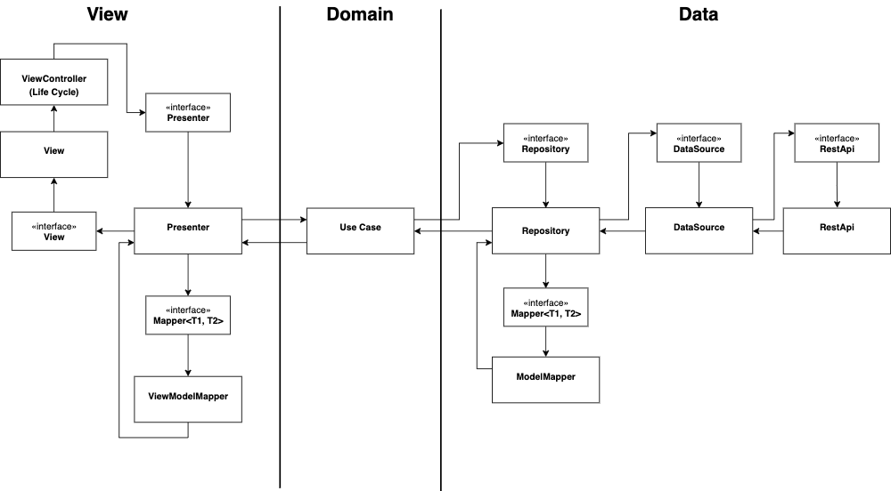

## External dependencies

* [Mimic](https://github.com/feliperuzg/Mimic) - Is a simple mocking network solution

* [Lottie](https://github.com/airbnb/lottie-ios) - Is a cross-platform library that natively renders vector based animations and art in realtime with minimal code.

* [SwiftFormat](https://github.com/nicklockwood/SwiftFormat) - Is a code library and command-line tool for reformatting Swift code on macOS or Linux.

* [SwiftLint](https://github.com/realm/SwiftLint) - Is a tool to enforce Swift style and conventions

* [📸 SnapshotTesting](https://github.com/pointfreeco/swift-snapshot-testing) - Is a delightful Swift snapshot testing.

* [Kingfisher](https://github.com/onevcat/Kingfisher) - Is a library for downloading and caching images from the web. It provides you a chance to use a pure-Swift way to work with remote images in your next app.

* [Nimble](https://github.com/Quick/Nimble) - Is a library to express the expected outcomes of Swift or Objective-C expressions.

## Views in ProductFinderApp

**First View with an animated Splash:**

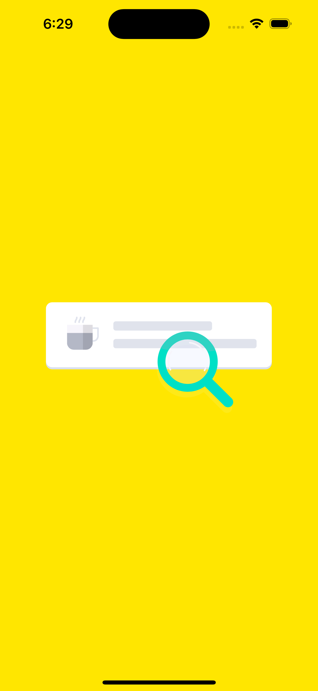 

**Second view with a search field located at the top of the App:**

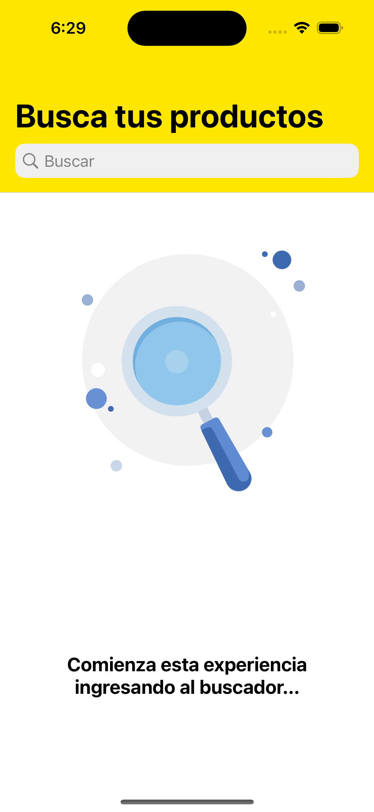 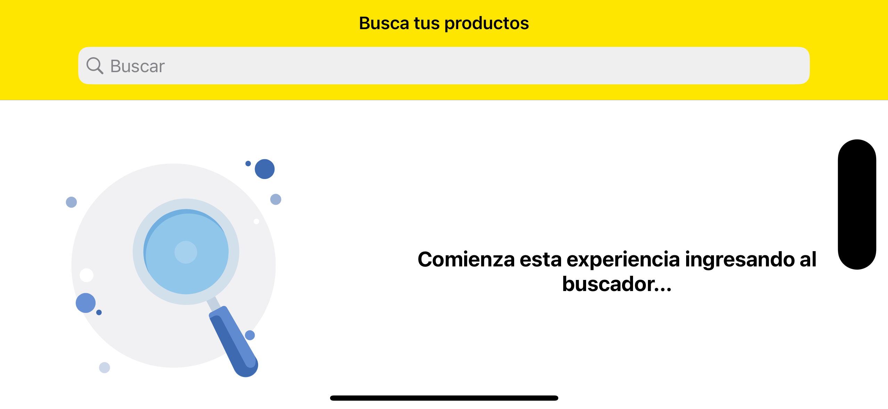

**Third view with a list of products related to the searched text:**

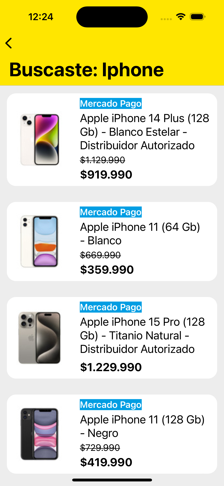 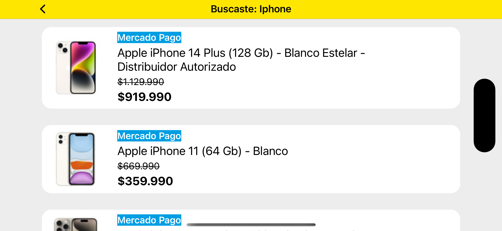

**Fourth view with more detailed information about the selected product:**

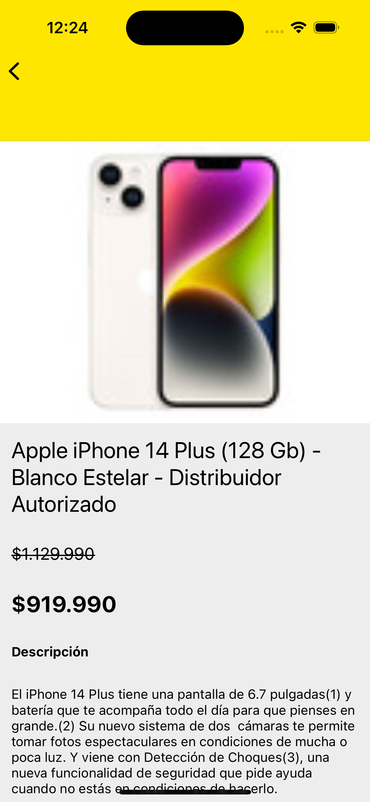 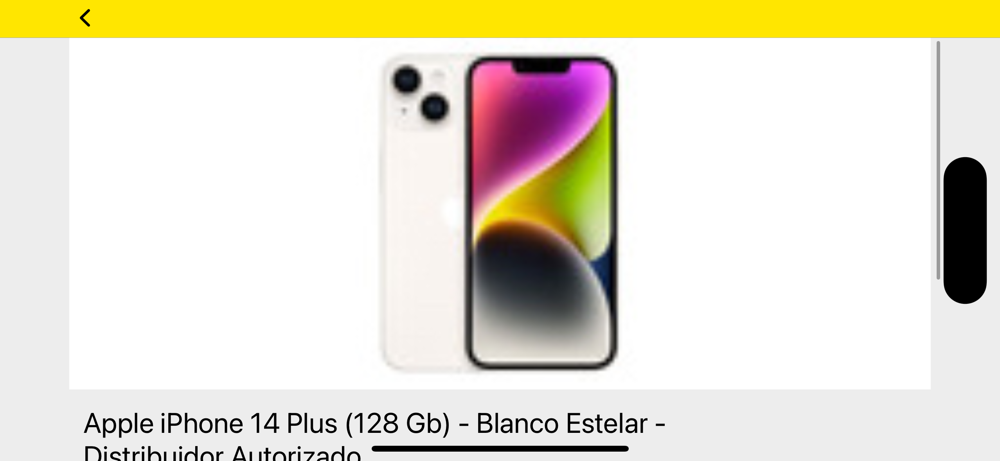

**Loading view:**

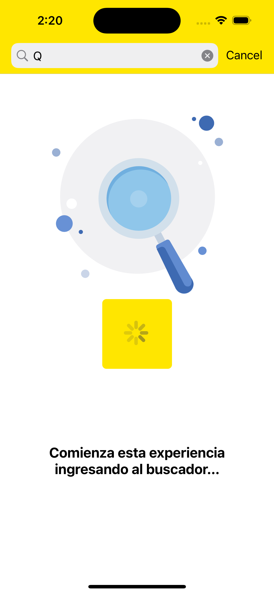

## Error Handling Views in ProductFinderApp

**Connection Error:**

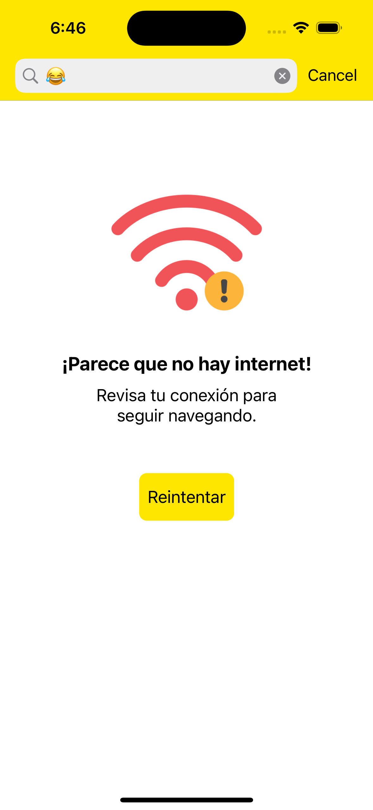 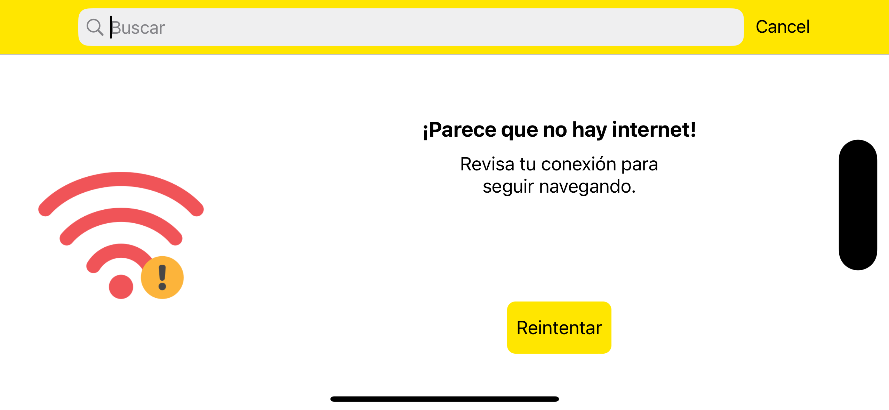

**Default Error:**

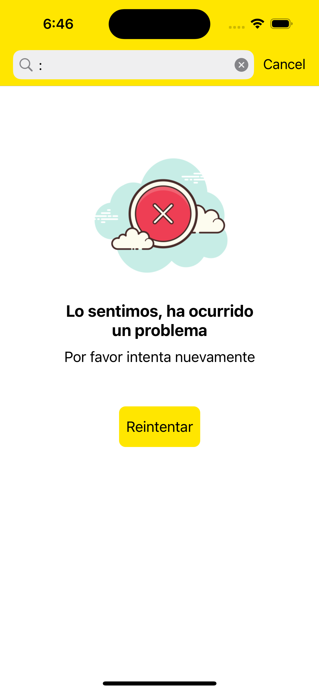 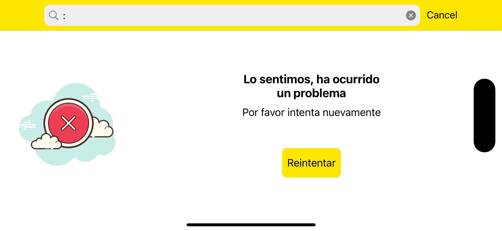

**Search Error:**

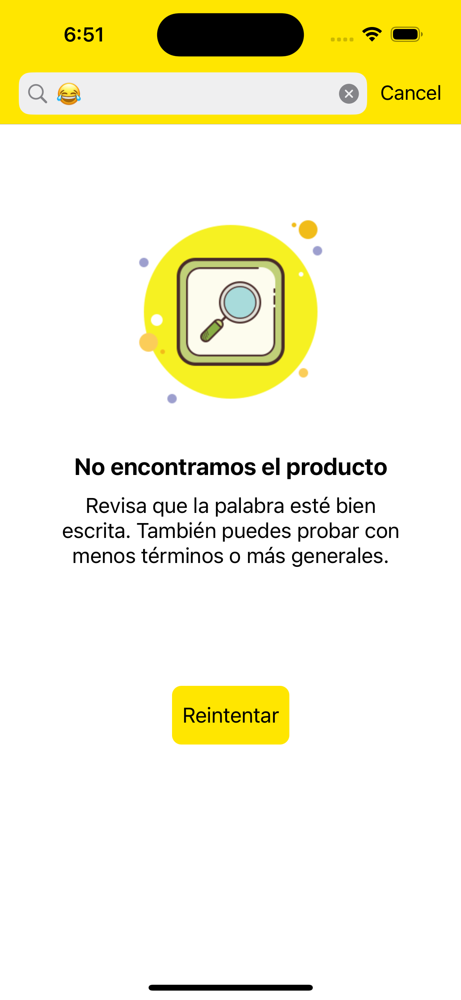 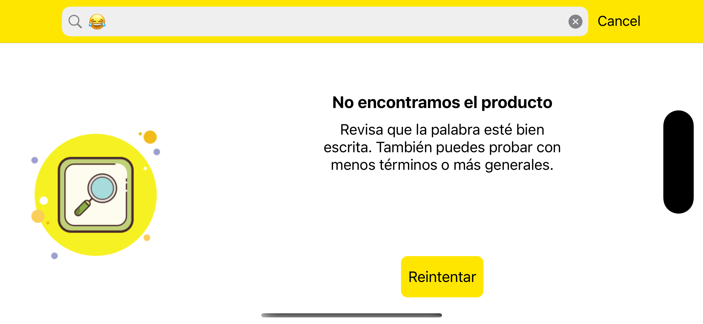


## Coverage Test (Unit Test)

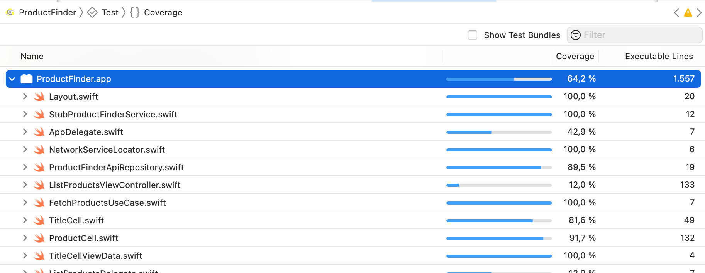

## Coverage Test (Unit Test + UI Test Snapshot)

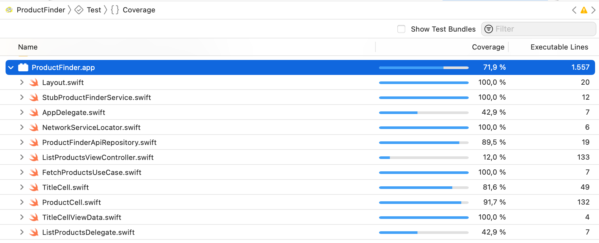

## Tasks pendings to improve ProductFinderApp

* Add CI/CD.
* Add more Snapshot tests for ViewControllers.
* Manage calling the APIs from other countries (MLA, MLC, MLB).
* Manage currency in case of calling the API from other countries.
* Separate the components in a separate module.


